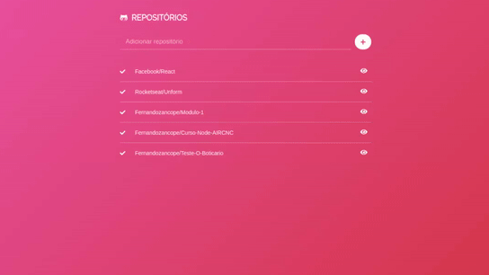

<h1 align="center" style="color:#e5464a;">
  GitHub Repositories List
</h1>

<blockquote align="center">
ReactJS application made to list repositories and issues that his has.
</blockquote>

<p align="center">
  

  <a href="https://rocketseat.com.br">
    
  </a>

  

</p>

<hr/>

<h3>:heavy_check_mark: About the project</h3>

List how many repositories do you want. With this you can list repositories and what issues his has, filtering by all issues, opened issues and closed issues with pagination system.

<h3 align="center">:octocat: Application Demo</h3>

<p align="center">

</p>

<a href="https://githubrepositorieslist.herokuapp.com/" align="center">See application on Heroku</a>

<hr />

<h3>:electric_plug: Requeriments</h3>

* NodeJS >= 10.16.3
* Yarn >= 1.19.1

<h3>:arrows_counterclockwise: Running the application</h3>

```console
// Clone the project
$ git clone github.repositories.list.git

// Entering the folder
$ cd github.repositories.list

// Installing the dependencies
$ yarn
```

```console
// In the terminal, run to start the project
$ yarn start
```

<hr/>

<h4 align="center">
<a href="http://linkedin.com/in/leonardoalmeida99">Connect me in LinkedIn</a> | <a href="http://behance.net/almeida99">See my Behance</a> | <a href="https://leunardo.dev">Click here to go to my CV</a>
</h4>
